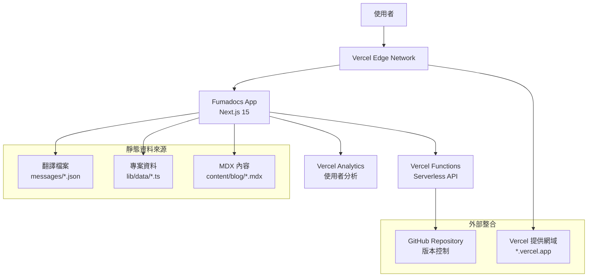
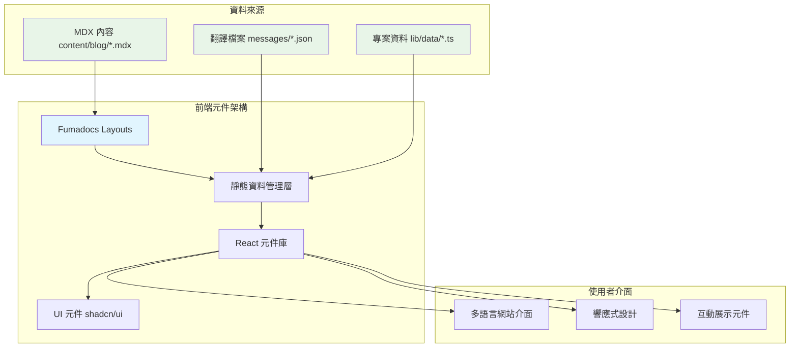
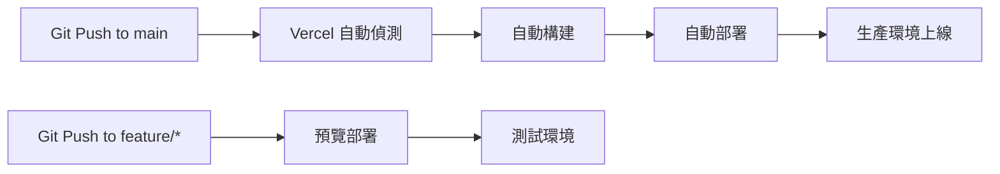

# 個人形象網站 Fullstack Architecture Document

## 📋 文件資訊

- **版本**: 1.0
- **日期**: 2025-09-09
- **作者**: Architect
- **審核狀態**: Approved

### Change Log

| Date       | Version | Description      | Author    |
| ---------- | ------- | ---------------- | --------- |
| 2025-09-09 | 1.0     | 初始架構文件建立 | Architect |

---

## 1. Introduction

### 專案概述

本文件定義「個人形象網站」的完整全棧架構，展示從前端到全端工程師的技術能力和產品思維。專案採用現代 Jamstack 架構配合 Serverless Functions，重點展示技術能力和作品集功能。

### 基於現有文件的關鍵發現

**從 PRD 和前端規格分析：**

- **框架選擇**: Fumadocs 作為主要框架，內建部落格和多語言支援
- **部署策略**: Vercel 平台全家桶，透過 Dashboard 直接部署
- **技術展示重點**: 排球 App "VolleyBro" 互動展示、多語言支援（中英日）
- **目標市場**: 台灣、遠端、日本求職市場

### Starter Template 分析

**架構決策理由:**

1. **Fumadocs 選擇**: 提供優秀的部落格和文檔功能，內建 MDX 和 i18n 支援
2. **Vercel 全平台**: 簡化部署流程，優秀的 CDN 效能，特別針對日本市場優化
3. **靜態優先策略**: 最大化使用免費服務額度，確保成本控制在 $0 USD/月

---

## 2. High Level Architecture

### Technical Summary

個人形象網站採用現代 **Jamstack 架構**，結合 **Fumadocs** 框架和 **Vercel** 全平台服務。前端使用 **Next.js 15** 配合 **React 18+** 和 **Tailwind CSS**，實現響應式多語言介面（中英日三語）。核心整合點包括排球 App 元件的即時展示、靜態資料管理，以及 MDX 驅動的技術部落格。基礎設施完全部署在 **Vercel 平台**，確保成本控制在免費額度內，同時達到 PRD 目標：提升求職競爭力和展示全端開發能力。

### Platform and Infrastructure Choice

基於深度分析，選擇 Vercel 全平台方案：

**Platform:** Vercel 全平台  
**Key Services:** Vercel 託管、Vercel Functions、Vercel Analytics、Edge Functions  
**Deployment Regions:** 全球邊緣網路，重點優化亞洲節點（東京、大阪）

**決策理由:**

- ✅ **完美契合需求**: Fumadocs + 互動展示 + 多語言
- ✅ **零成本風險**: 免費額度遠超個人網站需求
- ✅ **面試加分**: 展示現代工具鏈掌握
- ✅ **開發效率**: 專注內容創作而非基礎設施
- ✅ **全球效能**: 特別優化日本市場訪問

### Repository Structure

**Structure:** Monorepo with Fumadocs integration  
**Package Organization:**

- `/` - Fumadocs 主應用（網站前端）
- `/components` - React 元件庫
- `/lib` - 共享工具和靜態資料
- `/messages` - 多語言翻譯檔案

### High Level Architecture Diagram



### Architectural Patterns

**選定的架構模式:**

- **Jamstack Architecture**: 靜態站點生成搭配 serverless API - 理由: 最佳化效能、SEO 和成本控制，符合個人網站需求
- **Static-First Design**: 個人資料透過翻譯檔案管理 - 理由: 零資料庫維護，極佳效能，完美 SEO
- **Component-Based UI**: 可重用 React 元件搭配 TypeScript - 理由: 維護性和型別安全，展示前端開發能力
- **Framework-Native Integration**: 充分利用 Fumadocs 內建功能 - 理由: 減少自訂開發，提升可靠性
- **Content-as-Code**: MDX 驅動的部落格系統 - 理由: 版本控制友好，支援程式碼範例和互動元件
- **Edge-First Deployment**: Vercel 邊緣網路優化 - 理由: 全球訪問速度優化，特別針對日本市場

---

## **BlogPost（部落格文章）** - Fumadocs 文章寫作模式

**管理方式:** `content/docs/[lang]/\*.mdx` 多語言檔案

```markdown
## <!-- content/docs/zh-TW/react-best-practices.mdx -->

title: React 最佳實務指南
description: 深入探討 React 開發的最佳實務
date: 2024-09-07
author: 曾立維
tags: [React, 最佳實務, 效能優化]
cover: /images/blog/covers/react-best-practices.jpg

---

# React 最佳實務指南

本文將深入探討 React 開發中的最佳實務...
```

---

## 6. Components

### 系統元件架構（基於 Fumadocs）

#### **Layout System（佈局系統）**

**主要佈局元件:**

**1. HomeLayout - 主要展示頁面**

- **使用情境:** 首頁、作品集頁面、關於我頁面
- **技術棧:** Fumadocs HomeLayout + 自訂語言切換
- **依賴:** Fumadocs UI、翻譯檔案、主題系統

**2. DocsLayout - 技術文件專用**

- **使用情境:** 僅用於技術文檔（如 API 文檔），非主要展示頁面
- **技術棧:** Fumadocs DocsLayout + 側邊欄整合

**3. Blog Layout - Fumadocs 內建**

- **使用情境:** 部落格文章列表和內容頁面
- **技術棧:** 完全使用 Fumadocs 內建功能

#### **Static Data Management（靜態資料管理）**

**個人資料管理 - 透過 Fumadocs i18n 靜態資料**

**Key Interfaces:**

- `getProfileData(locale)`: 獲取多語言個人資料 (透過 Fumadocs source API)
- `getSkillsData(locale)`: 獲取技能展示資料
- `getSocialLinks()`: 獲取社群媒體連結

**Dependencies:** Fumadocs i18n 配置、TypeScript 類型定義

#### **Interactive Portfolio Components（互動作品集元件）**

**Responsibility:** 排球 App 展示和其他專案的互動式呈現

**Key Interfaces:**

- `ProjectCard`: 專案卡片展示
- `ProjectGrid`: 專案網格佈局
- `VolleyballDemo`: 排球 App 互動展示（未來功能）
- `TechStackBadge`: 技術標籤元件

**Dependencies:** 靜態專案資料、Fumadocs i18n 系統（未來階段加入互動狀態管理）

#### **Blog System - Fumadocs 原生支援**

**部落格功能完全由 Fumadocs 處理:**

- ✅ 自動 MDX 編譯和渲染
- ✅ 多語言路由
- ✅ 自動生成導航和目錄
- ✅ SEO 優化和 meta tags
- ✅ 內建搜尋整合

### 元件架構圖



---

## 7. Frontend Architecture

### 前端架構重新設計（基於 Fumadocs）

#### **Layout System（佈局系統）**

**HomeLayout 使用情境澄清:**

```typescript
// app/(home)/layout.tsx - 主要展示頁面
// 使用情境：首頁、作品集、關於我等展示內容
import { HomeLayout } from "fumadocs-ui/layouts/home";

export default function Layout({ children }: { children: ReactNode }) {
  return (
    <HomeLayout
      nav={{
        title: "Andrew Tseng",
        url: "/",
      }}
      links={[
        { text: "Portfolio", url: "/portfolio" },
        { text: "Blog", url: "/blog" },
        { text: "About", url: "/about" },
      ]}
    >
      {children}
    </HomeLayout>
  );
}
```

**DocsLayout 使用情境:**

```typescript
// app/docs/layout.tsx - 僅技術文件使用
// 使用情境：API 文檔、技術架構文件等純技術內容
import { DocsLayout } from "fumadocs-ui/layouts/docs";

export default function Layout({ children }: { children: ReactNode }) {
  return <DocsLayout tree={source.pageTree}>{children}</DocsLayout>;
}
```

#### **Component Architecture（元件架構）**

**基於靜態資料的元件設計:**

```typescript
// components/profile/ProfileHero.tsx
import { source } from '@/lib/source';

interface ProfileHeroProps {
  locale: string;
}

export function ProfileHero({ locale }: ProfileHeroProps) {
  // 使用 Fumadocs i18n 靜態資料
  const profileData = source.getPage(['profile'], locale);
  
  return (
    <section data-testid="profile-hero-section">
      <div data-testid="profile-card" className="glass-effect">
        
        <h1 data-testid="profile-name">{profileData?.title}</h1>
        <h2 data-testid="profile-title">全端工程師</h2>
        <p data-testid="profile-bio">{profileData?.description}</p>
      </div>
    </section>
  );
}
```

#### **State Management - 靜態優先架構**

**Phase 1: 純靜態資料管理**

```typescript
// lib/data/profile.ts - 靜態個人資料
export const profileData = {
  'zh-TW': {
    name: '曾立維',
    title: '全端工程師',
    bio: '專精於 React 和 Node.js 的全端開發'
  },
  'en': {
    name: 'Andrew Tseng',
    title: 'Full-stack Developer', 
    bio: 'Specialized in React and Node.js full-stack development'
  }
};

// Phase 2 (未來): 加入 Redux Toolkit 管理互動狀態
// 僅用於排球 App 等互動功能
```

#### **Routing Architecture - Next.js App Router + Fumadocs**

**路由結構:**

```
app/
├── [lang]/                    # Fumadocs i18n 多語言路由
│   ├── (home)/               # HomeLayout 群組
│   │   ├── page.tsx          # 首頁
│   │   ├── portfolio/page.tsx # 作品集
│   │   └── about/page.tsx     # 關於我
│   ├── docs/[[...slug]]/     # Fumadocs 文件系統
│   └── layout.tsx            # 語言佈局
├── globals.css               # 全域樣式
├── layout.tsx                # 根佈局
└── api/                      # Serverless API
    └── health/route.ts       # 健康檢查
```

---

## 8. Backend Architecture

### 後端架構（最小化實作）

#### **Serverless API Architecture**

**Phase 2: 互動展示 API（預計開發）:**

```typescript
// app/api/demo/volleyball/score/route.ts
export async function POST(request: Request) {
  const { action, team, points } = await request.json();

  return Response.json({
    success: true,
    current_score: { home: 15, away: 12 },
    "data-testid": "api-response",
  });
}
```

#### **Deployment Architecture - Vercel 簡化部署**

**通過 Vercel Dashboard 部署（推薦）:**

1. ✅ 在 Vercel Dashboard 點擊 "Import Git Repository"
2. ✅ 選擇 GitHub repository
3. ✅ Vercel 自動偵測 Next.js 並進行最佳配置
4. ✅ 自動設定環境變數和平台服務

**自動化部署流程:**



**當前架構成本:**

- ✅ Vercel Hobby Plan: $0
- ✅ 100GB 頻寬/月、無限制靜態檔案
- ✅ Edge Functions: 100 萬次請求/月
- ✅ 總成本: $0 USD/月

---

## 9. Unified Project Structure

### 完整專案目錄結構

```
andrewck24.github.io/
│
├── app/                          # Next.js 15 App Router
│   ├── [locale]/                 # next-intl 多語言路由
│   │   ├── (home)/               # HomeLayout 路由群組
│   │   │   ├── layout.tsx        # 首頁佈局
│   │   │   ├── page.tsx          # 首頁內容
│   │   │   ├── portfolio/
│   │   │   │   └── page.tsx      # 作品集頁面
│   │   │   └── about/
│   │   │       └── page.tsx      # 關於我頁面
│   │   ├── blog/                 # Fumadocs 部落格
│   │   │   └── [[...slug]]/
│   │   │       └── page.tsx      # 部落格頁面
│   │   └── docs/                 # 技術文件（未來）
│   │       ├── layout.tsx        # DocsLayout
│   │       └── [[...slug]]/
│   │           └── page.tsx
│   ├── api/                      # Serverless API Routes
│   │   ├── health/
│   │   │   └── route.ts          # 健康檢查
│   │   └── demo/                 # 未來互動功能
│   ├── layout.tsx                # 根佈局
│   ├── globals.css               # 全域樣式
│   └── sitemap.ts               # 動態 sitemap
│
├── components/                   # React 元件
│   ├── ui/                      # 基礎 UI 元件 (shadcn/ui)
│   ├── layout/                  # 佈局相關元件
│   ├── profile/                 # 個人資料相關元件
│   ├── portfolio/               # 作品集相關元件
│   └── common/                  # 通用元件
│
├── lib/                         # 共用邏輯和工具
│   ├── utils.ts                 # 工具函數
│   ├── config.ts                # 應用程式配置
│   ├── source.ts                # Fumadocs 資料來源
│   └── data/                    # 靜態資料
│       ├── projects.ts          # 專案資料
│       ├── skills.ts            # 技能資料
│       └── social-links.ts      # 社群連結
│
├── lib/                         # 共用邏輯和工具
│   ├── utils.ts                 # 工具函數
│   ├── config.ts                # 應用程式配置
│   ├── source.ts                # Fumadocs 資料來源
│   ├── i18n.ts                  # Fumadocs i18n 配置
│   └── data/                    # 靜態資料
│       └── social-links.ts      # 社群連結
│
├── content/                     # Fumadocs 內容檔案
│   ├── blog/                   # 部落格內容
│   │   ├── getting-started.mdx
│   │   ├── getting-started.zh-TW.mdx
│   │   ├── getting-started.ja.mdx
│   │   └── meta.json           # 文章 metadata
│   └── docs/                   # 技術文件（未來）
│
├── public/                     # 靜態資源
│   ├── images/
│   │   ├── profile/            # 個人頭像
│   │   ├── projects/           # 專案截圖
│   │   └── blog/               # 文章配圖
│   ├── favicon.ico
│   └── logo.svg
│
├── __tests__/                  # 測試檔案
│   ├── components/             # 元件測試
│   ├── e2e/                    # E2E 測試
│   └── utils/                  # 測試工具
│
├── types/                      # TypeScript 類型
│   ├── global.d.ts
│   ├── profile.ts
│   └── project.ts
│
├── next.config.js              # Next.js 配置
├── source.config.ts            # Fumadocs 配置
├── middleware.ts               # 多語言中介軟體
├── tailwind.config.ts          # Tailwind 配置
├── tsconfig.json               # TypeScript 配置
├── package.json                # 專案依賴
└── README.md                   # 專案說明
```

### 關鍵檔案配置

**next.config.js:**

```javascript
import createMDX from "fumadocs-mdx/next";

const withMDX = createMDX();

/** @type {import('next').NextConfig} */
const nextConfig = {
  images: {
    remotePatterns: [{ protocol: "https", hostname: "github.com" }],
  },
};

export default withMDX(nextConfig);
```

**Fumadocs i18n 配置檔案範例:**

```typescript
// lib/i18n.ts
import { defineI18n } from 'fumadocs-core/i18n';

export const { i18n, locales } = defineI18n({
  languages: [{
    code: 'zh-TW', 
    name: '繁體中文'
  }, {
    code: 'en',
    name: 'English'
  }, {
    code: 'ja', 
    name: '日本語'
  }],
  defaultLanguage: 'zh-TW',
  fallbackLanguage: 'en'
});
```

**靜態資料範例 (lib/data/profile.ts):**

```typescript
export const profileData = {
  'zh-TW': {
    name: '曾立維',
    title: '全端工程師',
    bio: '專精於 React 和 Node.js 的全端開發'
  },
  'en': {
    name: 'Andrew Tseng', 
    title: 'Full-stack Developer',
    bio: 'Specialized in React and Node.js development'
  },
  'ja': {
    name: 'アンドリュー・ツェン',
    title: 'フルスタック開発者',
    bio: 'React と Node.js を専門とするフルスタック開発'
  }
};
```

---

## 10. Development Workflow

### 開發工作流程設計

#### **本地開發環境設置**

**環境需求:**

- Node.js: 20.x LTS
- pnpm: 8.15+
- VS Code + 推薦擴展

**專案初始設置:**

```bash
# 1. Clone repository
git clone https://github.com/andrewck24/andrewck24.github.io.git
cd andrewck24.github.io

# 2. 安裝依賴
pnpm install

# 3. 啟動開發伺服器
pnpm dev
```

**開發命令腳本:**

```json
{
  "scripts": {
    "dev": "next dev",
    "build": "next build",
    "start": "next start",
    "lint": "next lint",
    "type-check": "tsc --noEmit",
    "test": "jest",
    "test:e2e": "playwright test"
  }
}
```

#### **功能開發流程**

**Feature Branch 工作流程:**

```bash
# 開發新功能
git checkout -b feature/new-portfolio-section
pnpm dev

# 提交前檢查
pnpm lint
pnpm type-check
pnpm test

# 提交變更
git add .
git commit -m "feat: add new portfolio section"
git push origin feature/new-portfolio-section

# Vercel 自動建立預覽環境
```

**內容創作流程 - 部落格文章:**

```bash
# 1. 建立多語言文章
mkdir content/blog/react-best-practices/
touch content/blog/react-best-practices.{mdx,zh-TW.mdx,ja.mdx}

# 2. 編寫內容（中文優先）
vim content/blog/react-best-practices.zh-TW.mdx

# 3. 翻譯其他語言版本
vim content/blog/react-best-practices.en.mdx
vim content/blog/react-best-practices.ja.mdx

# 4. 本地預覽
pnpm dev
# 訪問 http://localhost:3000/zh-TW/blog/react-best-practices

# 5. 提交發布
git add . && git commit -m "docs: add React best practices guide"
git push origin main  # Vercel 自動部署
```

**專案資料更新流程:**

```bash
# 1. 更新專案資料
vim lib/data/projects.ts

# 2. 新增翻譯內容
vim messages/zh-TW.json  # 新增 projects.new-project.*
vim messages/en.json     # 英文翻譯
vim messages/ja.json     # 日文翻譯

# 3. 新增專案圖片
mkdir public/images/projects/new-project/
# 複製專案截圖

# 4. 測試和提交
pnpm dev
git add . && git commit -m "feat: add new project to portfolio"
```

#### **測試驅動開發**

**元件開發 TDD (使用 data-testid):**

```typescript
// __tests__/components/profile-hero.test.tsx
describe("ProfileHero", () => {
  it("should display profile with correct testids", () => {
    render(<ProfileHero />);

    expect(screen.getByTestId("profile-hero-section")).toBeInTheDocument();
    expect(screen.getByTestId("profile-name")).toHaveTextContent("曾立維");
    expect(screen.getByTestId("view-portfolio-btn")).toBeInTheDocument();
  });
});
```

**E2E 測試:**

```typescript
// __tests__/e2e/portfolio.spec.ts
test("should display projects and switch languages", async ({ page }) => {
  await page.goto("/zh-TW/portfolio");

  await expect(page.locator('[data-testid="portfolio-page"]')).toBeVisible();
  await expect(page.locator('[data-testid="project-card"]')).toHaveCount(2);

  // 測試語言切換
  await page.click('[data-testid="language-switch"]');
  await page.click('[data-testid="language-option-en"]');
  await expect(page).toHaveURL(/\/en\/portfolio/);
});
```

#### **程式碼品質保證**

**Pre-commit Hooks:**

```bash
# .husky/pre-commit
#!/bin/sh
npx lint-staged
pnpm type-check
pnpm test
```

**品質檢查腳本:**

```bash
#!/bin/bash
# scripts/quality-check.sh
echo "🔍 執行程式碼品質檢查..."

pnpm type-check || exit 1
pnpm lint || exit 1
pnpm test || exit 1
pnpm build || exit 1
pnpm test:e2e || exit 1

echo "✅ 所有品質檢查通過！"
```

#### **部署和發布流程**

**Vercel 自動部署:**

```bash
# 開發環境
feature/* → Vercel Preview Deploy → 測試預覽

# 生產環境
main → Vercel Production Deploy → 自動上線
```

**發布檢查清單:**

```markdown
## 發布前檢查清單

### 程式碼品質

- [ ] 所有測試通過 (pnpm test)
- [ ] E2E 測試通過 (pnpm test:e2e)
- [ ] 型別檢查通過 (pnpm type-check)
- [ ] 建構成功 (pnpm build)

### 內容完整性

- [ ] 所有翻譯檔案同步更新
- [ ] 新專案圖片已上傳
- [ ] 部落格文章 frontmatter 完整

### 功能測試

- [ ] 多語言切換正常
- [ ] 響應式設計正常
- [ ] Lighthouse 分數 > 90
```

---

## 11. Security and Performance

### 安全性考量

**前端安全:**

- ✅ **CSP Headers**: Vercel 自動配置基礎 CSP
- ✅ **XSS Prevention**: React 自動轉義，Tailwind CSS 無內聯樣式
- ✅ **HTTPS**: Vercel 自動提供 SSL 證書

**後端安全:**

- ✅ **Input Validation**: Zod 驗證 schema（未來 API 使用）
- ✅ **Rate Limiting**: Vercel Edge Functions 內建保護
- ✅ **CORS**: Next.js middleware 統一處理

### 效能優化

**前端效能目標:**

- **Bundle Size**: < 200KB
- **First Paint**: < 1s
- **LCP**: < 2.5s
- **Lighthouse Score**: > 90

**優化策略:**

- ✅ **靜態生成**: 所有頁面預渲染
- ✅ **圖片優化**: Next.js Image component
- ✅ **字體優化**: 系統字體優先
- ✅ **CDN**: Vercel 全球邊緣網路

---

## 13. Monitoring and Observability

### 監控策略

**Vercel 內建監控:**

- ✅ **部署監控**: 自動追蹤部署狀態和歷史
- ✅ **函數監控**: Serverless Functions 執行日誌
- ✅ **效能監控**: Core Web Vitals 追蹤
- ✅ **錯誤追蹤**: 運行時錯誤自動收集

**關鍵指標:**

```typescript
// 前端指標
interface FrontendMetrics {
  LCP: "<2.5s"; // 最大內容繪製
  FID: "<100ms"; // 首次輸入延遲
  CLS: "<0.1"; // 累計版面位移
  TTI: "<3.5s"; // 互動就緒時間
}

// 後端指標
interface BackendMetrics {
  responseTime: "<500ms"; // API 回應時間
  uptime: ">99.9%"; // 系統可用性
  errorRate: "<1%"; // 錯誤率
}
```

---

## 14. 架構總結與實作路線

### 🎯 架構設計總結

**技術架構特色:**

1. ✅ **極簡主義** - 最大化框架內建功能，最小化自訂開發
2. ✅ **靜態優先** - 零資料庫依賴，完美 SEO 和效能
3. ✅ **成本控制** - $0 USD/月運營成本
4. ✅ **國際化友好** - 中英日三語無縫支援
5. ✅ **測試驅動** - data-testid 標註，完整覆蓋

**關鍵決策摘要:**

- **主框架**: Fumadocs（內建 MDX + i18n）
- **部署平台**: Vercel 全平台（一鍵部署）
- **資料策略**: 靜態檔案 + 翻譯系統
- **測試策略**: Jest + Playwright + data-testid

### 🚀 實作路線圖

#### **Phase 1: 基礎架構**

```bash
[x] Fumadocs 專案初始化
[ ] Vercel 部署配置
[x] 多語言翻譯檔案設置
[x] 基礎元件和樣式系統
[ ] 個人資料頁面和技能展示
[ ] 專案作品集展示
[ ] 響應式設計實作
[ ] SEO 優化
[ ] 部落格文章撰寫
[ ] 排球 App 展示整合
[ ] 效能優化
[ ] 測試完整覆蓋
```

#### **Phase 2 互動功能（未來）**

```bash
[ ] VolleyBro 排球 App 即時互動
[ ] API 日誌展示系統
[ ] 即時互動 Demo
[ ] 監控和分析整合
```

### ✅ 成功指標

**技術指標:**

- Lighthouse Score > 90
- Core Web Vitals 達標
- 測試覆蓋率 > 80%
- 建構時間 < 2 分鐘

**業務指標:**

- 多語言內容完整度 100%
- 載入速度 < 2.5s
- 月度營運成本 $0
- 求職面試轉換率提升

---

**文件完成日期**: 2025-09-09  
**架構師**: BMad Architect
**狀態**: Ready for Implementation ✅
