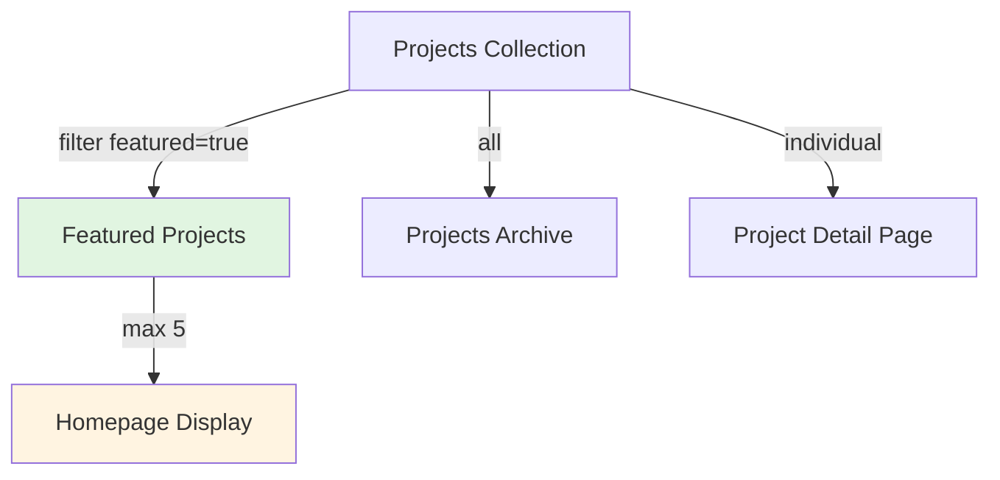

# Data Model: 作品集展示功能

**Feature**: 002-projects-1-home
**Date**: 2025-10-10
**Status**: Approved

## Overview

本文件定義作品集展示功能的資料模型，包含實體定義、關係、驗證規則以及資料流向。

---

## Entities

### 1. Project (專案)

代表一個完整的作品集項目。

**Attributes**:

| 欄位          | 型別                      | 必填 | 說明                                 | 範例                                    |
| ------------- | ------------------------- | ---- | ------------------------------------ | --------------------------------------- |
| `slug`        | string                    | ✅   | URL 友善的唯一識別碼                 | `"andrewck24-portfolio"`                |
| `locale`      | `'zh-TW' \| 'en' \| 'ja'` | ✅   | 語言版本                             | `"zh-TW"`                               |
| `title`       | string                    | ✅   | 專案標題（≤100 字元）                | `"個人作品集網站"`                      |
| `description` | string                    | ✅   | 簡短描述（≤200 字元）                | `"使用 Next.js 建構的響應式作品集"`     |
| `image`       | string                    | ✅   | 代表圖片路徑（相對或絕對）           | `"/images/projects/portfolio-hero.jpg"` |
| `date`        | Date                      | ❌   | 專案完成/發布日期（ISO 8601）        | `"2024-10-10"`                          |
| `featured`    | boolean                   | ❌   | 是否為精選專案（預設 `false`）       | `true`                                  |
| `order`       | number                    | ❌   | 手動排序權重（featured=true 時使用） | `1`                                     |
| `content`     | MDXContent                | ✅   | 詳細介紹內容（MDX 格式）             | _(MDX file body)_                       |

**Derived Fields** (computed at runtime):

| 欄位       | 型別   | 說明               | 計算方式                    |
| ---------- | ------ | ------------------ | --------------------------- |
| `url`      | string | 完整的詳細頁面 URL | `/[locale]/projects/[slug]` |
| `sections` | object | 內容四段落結構     | 從 MDX 中提取 h2 標題       |

**MDX Frontmatter Example**:

```yaml
---
title: 個人作品集網站
description: 使用 Next.js 15、fumadocs、shadcn/ui 建構的響應式個人作品集
image: /images/projects/portfolio-hero.jpg
date: 2024-10-10
featured: true
order: 1
---
```

**Content Structure** (四段落):

```markdown
## 此專案欲解決的問題

（問題陳述內容）

## 思考過程

（思考過程內容）

## 採用方案

（解決方案內容）

## 產生的影響

（影響成果內容）
```

**Validation Rules**:

```typescript
const projectSchema = z.object({
  title: z.string().min(1).max(100),
  description: z.string().min(1).max(200),
  image: z.string().regex(/\.(jpg|jpeg|png|webp|avif)$/i),
  date: z.string().regex(/^\d{4}-\d{2}-\d{2}$/), // YYYY-MM-DD
  featured: z.boolean().optional().default(false),
  order: z.number().int().min(1).max(99).optional(),
});
```

---

### 2. FeaturedProject (精選專案)

精選專案是 Project 的子集，並非獨立實體，而是透過過濾條件從 Project 中篩選而來。

**Selection Criteria**:

- `featured === true`
- 數量限制：每個 locale 最多 5 個
- 排序依據：`order` 欄位（若未設定則依 `date` 降序）

**Type Definition**:

```typescript
type FeaturedProject = Project & {
  featured: true;
  order?: number; // 1-5
};
```

**Filtering Logic**:

```typescript
export async function getFeaturedProjects(
  locale: Locale
): Promise<FeaturedProject[]> {
  const allProjects = projectsSource.getPages();

  return allProjects
    .filter(
      (p): p is FeaturedProject =>
        p.locale === locale && p.data.featured === true
    )
    .slice(0, 5); // meta.json pages 陣列已排序
}
```

**Constraints**:

- Featured projects per locale: **≤5**
- Order values: **unique** per locale
- If `order` not specified: fallback to `meta.json` pages 陣列順序

---

## Relationships



### Locale-based Partitioning

```plaintext
Project (zh-TW) ──┐
Project (en)     ──┼── Same logical project, different language
Project (ja)     ──┘
```

**Key Points**:

- 每個 locale 獨立管理 featured 狀態
- 多語言版本共享 `slug`，但內容獨立
- 精選作品可能在不同語言有不同選擇

---

## Data Flow

### 1. Content Creation Flow

```plaintext
1. 編輯者撰寫 MDX 檔案
   └─> content/projects/zh-TW/my-project.mdx

2. fumadocs-mdx 編譯時解析
   └─> Zod schema 驗證 frontmatter

3. meta.json 定義排序
   └─> { "pages": ["my-project", ...] }

4. 建置時生成靜態資料
   └─> projectsSource.getPages()
```

### 2. Homepage Display Flow

```plaintext
1. Homepage Component 請求精選專案
   └─> getFeaturedProjects(locale)

2. 過濾 & 排序
   └─> featured=true, slice(0,5)

3. ProjectCard 渲染
   └─> 首張 hero, 其餘 compact

4. 使用者點擊
   └─> ViewTransition + 導航至 /projects/[slug]
```

### 3. Detail Page Flow

```plaintext
1. URL: /zh-TW/projects/my-project
   └─> Next.js dynamic route [[...slug]]

2. projectsSource.getPage([slug], locale)
   └─> 取得完整 MDX 內容

3. 渲染 ProjectDetail Component
   └─> Hero image + 四段落結構

4. ViewTransition (back)
   └─> 返回首頁
```

---

## Storage Implementation

### File System Structure

```plaintext
content/projects/
├── zh-TW/
│   ├── meta.json
│   ├── andrewck24-portfolio.mdx
│   ├── ai-chatbot-platform.mdx
│   └── ...
├── en/
│   ├── meta.json
│   └── (逐步加入英文版本)
└── ja/
    ├── meta.json
    └── (逐步加入日文版本)
```

### meta.json Schema

```json
{
  "title": "專案作品集",
  "description": "展示技術專案與成果",
  "pages": [
    "andrewck24-portfolio",
    "ai-chatbot-platform",
    "e-commerce-optimization"
  ]
}
```

**Behavior**:

- `pages` 陣列定義顯示順序
- fumadocs-mdx 自動依此順序返回 pages
- 若 frontmatter 設定 `order`，優先使用 frontmatter（備選機制）

---

## Image Management

### Image Storage

```
public/images/projects/
├── andrewck24-portfolio/
│   ├── hero.jpg           # 1200x675 (16:9)
│   ├── screenshot-1.jpg
│   └── screenshot-2.jpg
└── ai-chatbot-platform/
    └── hero.jpg
```

### Image Specifications

| 用途                 | 尺寸            | 格式      | 最佳化           |
| -------------------- | --------------- | --------- | ---------------- |
| Hero (首張卡片)      | 1200x675 (16:9) | WebP/AVIF | ✅ Next.js Image |
| Thumbnail (其餘卡片) | 600x600 (1:1)   | WebP/AVIF | ✅ Lazy loading  |
| Detail Page Hero     | 1600x900 (16:9) | WebP/AVIF | ✅ Priority load |

### Next.js Image Integration

```tsx
<Image
  src={project.image}
  alt={project.title}
  width={1200}
  height={675}
  priority={isHero}
  loading={isHero ? undefined : "lazy"}
  className="aspect-video object-cover"
/>
```

---

## Validation & Error Handling

### Frontmatter Validation

```typescript
// In source.config.ts
const projectFrontmatterSchema = frontmatterSchema.extend({
  featured: z.boolean().optional(),
  order: z.number().int().min(1).max(99).optional(),
});

// Validation errors throw at build time
```

### Runtime Validation

```typescript
// getFeaturedProjects() validation
if (featuredProjects.length === 0) {
  console.warn(`No featured projects found for locale: ${locale}`);
  return [];
}

if (featuredProjects.length > 5) {
  console.warn(
    `Too many featured projects (${featuredProjects.length}), showing first 5`
  );
}
```

### Missing Content Handling

| 情況             | 處理方式                               |
| ---------------- | -------------------------------------- |
| 圖片不存在       | Next.js Image fallback + console.error |
| MDX 段落缺失     | 顯示空段落（不阻擋渲染）               |
| locale 無內容    | 降級至 zh-TW（預設語言）               |
| 無 featured 專案 | 顯示最新 5 個專案（依 date 排序）      |

---

## Type Definitions

### Core Types

```typescript
// src/types/project.ts

/** MDX Frontmatter for project pages */
export interface ProjectFrontmatter {
  title: string;
  description: string;
  image: string;
  date: string; // ISO 8601 YYYY-MM-DD
  featured?: boolean;
  order?: number;
}

/** Project metadata (frontmatter + derived fields) */
export interface ProjectMetadata extends ProjectFrontmatter {
  slug: string;
  locale: "zh-TW" | "en" | "ja";
  url: string;
}

/** Full project content with MDX */
export interface ProjectContent {
  metadata: ProjectMetadata;
  body: MDXContent;
  sections: {
    problem: string;
    thinking: string;
    solution: string;
    impact: string;
  };
}

/** Featured project (derived from Project) */
export type FeaturedProject = ProjectMetadata & {
  featured: true;
};
```

### fumadocs Integration

```typescript
// src/lib/source.ts
import { projects } from "@/.source";
import { loader } from "fumadocs-core/source";
import { createMDXSource } from "fumadocs-mdx";
import { i18n } from "@/lib/i18n";

export const projectsSource = loader({
  baseUrl: "/projects",
  source: createMDXSource(projects),
  i18n,
});

export type ProjectPage = (typeof projectsSource)["pageTree"]["children"][0];
```

---

## Migration & Compatibility

### Initial Data Seeding

建議初始資料包含 3-5 個專案（zh-TW）：

1. **andrewck24-portfolio** (order: 1) - 本專案自己
2. **example-project-2** (order: 2) - 佔位專案
3. **example-project-3** (order: 3) - 佔位專案

### Future Extensions

可能的未來擴充（不在此功能範圍）：

- 技術標籤（tags）: `string[]`
- GitHub 連結: `string`
- 專案狀態: `'active' | 'archived' | 'in-progress'`
- 相關專案: `string[]` (slugs)

**原則**: 遵循 YAGNI（You Aren't Gonna Need It），暫不實作未確認需求。

---

## Summary

| 實體            | 來源               | 數量限制      | 排序方式                      |
| --------------- | ------------------ | ------------- | ----------------------------- |
| Project         | MDX files          | Unlimited     | meta.json pages 陣列          |
| FeaturedProject | Project (filtered) | ≤5 per locale | meta.json + frontmatter order |

**Key Design Decisions**:

1. **靜態優先**: 使用 fumadocs-mdx，建置時生成靜態資料
2. **型別安全**: Zod schema 驗證 + TypeScript 型別定義
3. **i18n 內建**: 語言版本透過 locale 分離管理
4. **簡單排序**: 依賴 meta.json，無複雜排序邏輯
5. **漸進式**: zh-TW 優先，en/ja 逐步加入

---

**Approved**: 2025-10-10
**Next Step**: 建立 TypeScript contracts（contracts/project-schema.ts）
